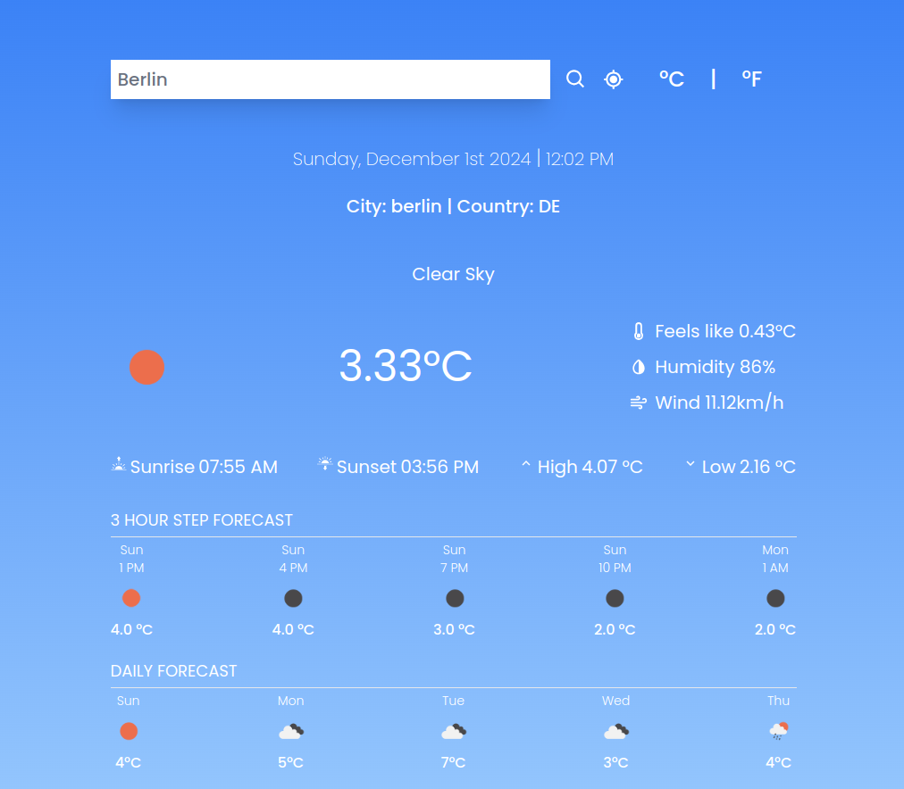

# Weather App

## About The Project

The Weather App is a sleek  application designed to provide real-time weather updates and forecasts. Built with React and Tailwind CSS, it utilizes modern web development practices and the OpenWeather API. Users can search for any city worldwide and enjoy:

- 🌤 **Current weather conditions**: Temperature, humidity, wind speed, and more.
- 🕒 **3-hour interval forecasts**: Predictions for the next 5 days.
- 🌈 **Dynamic weather icons**: Visually appealing icons to match current weather conditions.



## Built With

- ⚛️ **React** - A powerful JavaScript library for building user interfaces.
- 🎨 **Tailwind CSS** - A utility-first CSS framework for fast and responsive designs.
- 🌐 **OpenWeather API** - A reliable API for accurate weather data.
- 🖼 **React Icons** - Beautiful and scalable icons for additional visual appeal.

## Getting Started

Follow these steps to set up and run the Weather App locally:

### Prerequisites

Ensure the following are installed on your system:
- **Node.js**
- **npm** or **yarn**

### Installation

1. Clone the repository:
   ```bash
   git clone https://github.com/ktabassum1809/weather-app.git
   ```
2. Navigate to the project directory:
   ```bash
   cd weather-app
   ```
3. Install dependencies:
   ```bash
   npm install
   ```
   or
   ```bash
   yarn install
   ```

4. Start the development server:
   ```bash
   npm run dev
   ```
   or
   ```bash
   yarn start
   ```
The development server will start, and you can view the app in your browser at 
```bash
http://localhost:5173.

```
## Features

- 🔍 **Search for Cities**: Type a city name to get instant weather updates.
- 🌡 **Real-Time Data**: View live temperature, humidity, wind speed, and more.
- 🕒 **Hourly Forecast**: 3-hour step forecasts for the next 5 days.
- 🌇 **Sunrise & Sunset Times**: Know when the day starts and ends.
- 🌐 **Unit Toggle**: Switch between Celsius and Fahrenheit.


## Roadmap

- [ ] 🌍 Add geolocation-based weather updates.
- [ ] 💎 Enhance UI with animations and transitions.
- [ ] ⚠️ Include weather alerts and notifications.


## Usage

- **Search**: Enter a city name in the search bar and click the 🔍 icon.
- **View Details**: Check the current weather and the 3-hour step forecast.
- **Toggle Units**: Switch between °C and °F using the temperature toggle button.

## Contact

👤 **Your Name**
- 📧 [Your Email](mailto:ktabassum1809@gmail.com)
- 🖥 [GitHub Repository](https://github.com/ktabassum1809/weather-app.git)

## Acknowledgments

- 🌐 [OpenWeather API](https://openweathermap.org/api) for weather data.
- 🎨 [Tailwind CSS](https://tailwindcss.com/) for styling.
- ⚛️ [React Icons](https://react-icons.github.io/react-icons/) for elegant icons.
- 📘 [React Documentation](https://reactjs.org/) for development guidance.
